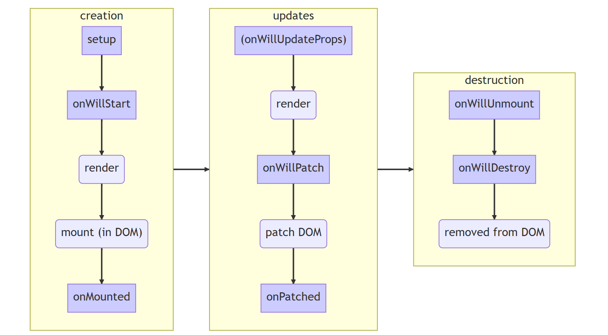

# Chapter 1: Owl components

https://www.odoo.com/documentation/17.0/developer/tutorials/discover_js_framework/01_owl_components.html


- This chapter introduces the **Owl framework**, a tailor-made component system for Odoo
- https://github.com/odoo/owl
- The main building blocks of OWL are **components** and **templates**
- https://github.com/odoo/owl/blob/master/doc/reference/component.md
- https://github.com/odoo/owl/blob/master/doc/reference/templates.md


In Owl, every part of user interface is managed by a *component*: they hold the logic and define the *templates* that are used to render the user interface. In practice, a component is represented by a small *JavaScript class* subclassing the *Component class*.

To get started, you need a running Odoo server and a development environment setup. Before getting into the exercises, make sure you have followed all the steps described in this *tutorial introduction*.


-  💡 **Tip**:
- If you use *Chrome* as your web browser, you can install the `Owl Devtools` extension
- This extension provides many features to help you understand and profile any Owl application

In this chapter, we use the `awesome_owl` addon, which provides a simplified environment that only contains Owl and a few other files. The goal is to learn Owl itself, without relying on Odoo web client code.

- The solutions for each exercise of the chapter are hosted on the official Odoo tutorials repository
- It is recommended to try to solve them first without looking at the solution!
- https://github.com/odoo/tutorials/commits/17.0-discover-js-framework-solutions/awesome_owl


## Example: a `Counter` component

First, let us have a look at a simple example. The `Counter` component shown below is a component that maintains an internal number value, displays it, and updates it whenever the user clicks on the button.

```
/** @odoo-module **/

import { Component, useState } from "@odoo/owl";

export class Counter extends Component {
    static template = "my_module.Counter";

    setup() {
        this.state = useState({ value: 0 });
    }

    increment() {
        this.state.value++;
    }
}
```

The `Counter` component specifies the name of a template that represents its html. It is written in *XML* using the *QWeb* language:

```
<templates xml:space="preserve">
   <t t-name="my_module.Counter">
      <p>Counter: <t t-esc="state.value"/></p>
      <button class="btn btn-primary" t-on-click="increment">Increment</button>
   </t>
</templates>
```

## 1. Displaying a counter

- http://192.168.1.60:8069/awesome_owl

- As a first exercise, let us modify the `Playground` component located in `awesome_owl/static/src/` to turn it into a counter
- To see the result, you can go to the `/awesome_owl` route with your browser

---

1. Modify `playground.js` so that it acts as a counter like in the example above
- Keep `Playground` for the class name
- You will need to use the `useState` hook so that the component is re-rendered whenever any part of the state object that has been read by this component is modified

2. In the same component, create an `increment` method

3. Modify the template in `playground.xml` so that it displays your counter variable
- Use `t-esc` to output the data
- https://github.com/odoo/owl/blob/master/doc/reference/templates.md#outputting-data

4. Add a button in the template and specify a `t-on-click` attribute in the button to trigger the `increment` method whenever the button is clicked
- https://github.com/odoo/owl/blob/master/doc/reference/event_handling.md#event-handling

---

- ⚠️ **Important**:
- Don’t forget `/** @odoo-module **/` in your JavaScript files
- https://www.odoo.com/documentation/17.0/developer/reference/frontend/javascript_modules.html#frontend-modules-native-js

---

- 💡 **Tip**:
- The Odoo JavaScript files downloaded by the browser are minified
- For debugging purpose, it’s easier when the files are not minified
- Switch to `debug mode with assets` so that the files are not minified
- https://www.odoo.com/documentation/17.0/applications/general/developer_mode.html#developer-mode-activation

---

- This exercise showcases an important feature of Owl: the **reactivity** system
- The `useState` function wraps a value in a proxy so Owl can keep track of which component needs which part of the state, so it can be updated whenever a value has been changed
- Try removing the `useState` function and see what happens.
- https://github.com/odoo/owl/blob/master/doc/reference/reactivity.md


- **tutorials/awesome_owl/static/src/playground.js**
```
import { Component, useState } from "@odoo/owl";

export class Playground extends Component {
  static template = "awesome_owl.playground";

  setup() {
    this.state = useState({ counter: 0 });
  }

  increment() {
    this.state.counter++;
  }
}
```

- **tutorials/awesome_owl/static/src/playground.xml**
```
<?xml version="1.0" encoding="UTF-8" ?>
<templates xml:space="preserve">
    <t t-name="awesome_owl.playground">
        <div class="p-3">
            hello world
        </div>
        <div class="p-3">
            <p>Counter: <t t-esc="state.counter"/>
            </p>
            <button class="btn btn-primary" t-on-click="increment">
                Increment
            </button>
        </div>
    </t>
</templates>
```


## 2. Extract Counter in a sub component

- For now we have the logic of a counter in the `Playground` component, but it is not reusable
- Let us see how to create a **sub-component** from it:
- https://github.com/odoo/owl/blob/master/doc/reference/component.md#sub-components

---

1. Extract the counter code from the `Playground` component into a new `Counter` component

2. You can do it in the same file first, but once it’s done, update your code to move the `Counter` in its own folder and file
- Import it relatively from `./counter/counter`
- Make sure the template is in its own file, with the same name

3. Use `<Counter/>` in the template of the `Playground` component to add two counters in your playground

---

- 💡 **Tip**:
- By convention, most components code, template and css should have the same snake-cased name as the component
- For example, if we have a `TodoList` component, its code should be in `todo_list.js`, `todo_list.xml` and if necessary, `todo_list.scss`

---

- **tutorials/awesome_owl/static/src/counter/counter.js**
```
/** @odoo-module **/

import { Component, useState } from "@odoo/owl";

export class Counter extends Component {
  static template = "awesome_owl.counter";

  setup() {
    this.state = useState({ counter: 0 });
  }

  increment() {
    this.state.counter++;
  }
}
```

- **tutorials/awesome_owl/static/src/counter/counter.xml**
```
<?xml version="1.0" encoding="UTF-8" ?>
<templates xml:space="preserve">
    <t t-name="awesome_owl.counter">
        <div class="p-3">
            <p>Counter: <t t-esc="state.counter"/>
            </p>
            <button class="btn btn-primary" t-on-click="increment">
                Increment
            </button>
        </div>
    </t>
</templates>
```

- **tutorials/awesome_owl/static/src/playground.js**
```
/** @odoo-module **/

import { Component, useState } from "@odoo/owl";
import { Counter } from "./counter/counter";

export class Playground extends Component {
  static template = "awesome_owl.playground";
  static components = { Counter };
}
```

- **tutorials/awesome_owl/static/src/playground.xml**
```
<?xml version="1.0" encoding="UTF-8" ?>
<templates xml:space="preserve">
    <t t-name="awesome_owl.playground">
        <div class="p-3">
            hello world
        </div>
        <div class="d-flex justify-content-start">
            <Counter />
            <Counter />
        </div>
    </t>
</templates>
```


## 3. A simple Card component

- Components are really the most natural way to divide a complicated user interface into multiple reusable pieces
- But to make them truly useful, it is necessary to be able to communicate some information between them
- Let us see how a parent component can provide information to a sub component by using *attributes* (most commonly known as `props`)
- https://github.com/odoo/owl/blob/master/doc/reference/props.md

---

- The goal of this exercise is to create a `Card` component, that takes two *props*: `title` and `content`
- For example, here is how it could be used:
```
<Card title="'my title'" content="'some content'"/>
```

- The above example should produce some html using bootstrap that look like this:
```
<div class="card d-inline-block m-2" style="width: 18rem;">
    <div class="card-body">
        <h5 class="card-title">my title</h5>
        <p class="card-text">
         some content
        </p>
    </div>
</div>
```

1. Create a `Card` component
2. Import it in `Playground` and display a few cards in its template

---

- **tutorials/awesome_owl/static/src/card/card.js**
```
/** @odoo-module **/

import { Component } from "@odoo/owl";

export class Card extends Component {
  static template = "awesome_owl.card";
}
```

- **tutorials/awesome_owl/static/src/card/card.xml**
```
<?xml version="1.0" encoding="UTF-8" ?>
<templates xml:space="preserve">
    <t t-name="awesome_owl.card">
        <div class="card d-inline-block m-2" style="width: 18rem;">
            <div class="card-body">
                <h5 class="card-title">
                    <t t-esc="props.title"/>
                </h5>
                <p class="card-text">
                    <t t-esc="props.content"/>
                </p>
            </div>
        </div>
    </t>
</templates>
```

- **tutorials/awesome_owl/static/src/playground.js**
```
/** @odoo-module **/

import { Component } from "@odoo/owl";
import { Counter } from "./counter/counter";
import { Card } from "./card/card";

export class Playground extends Component {
  static template = "awesome_owl.playground";
  static components = { Counter, Card };
}
```

- **tutorials/awesome_owl/static/src/playground.xml**
```
<?xml version="1.0" encoding="UTF-8" ?>
<templates xml:space="preserve">
    <t t-name="awesome_owl.playground">
        <div class="p-3">
            hello world
        </div>
        <!-- counter -->
        <div class="d-flex justify-content-start">
            <Counter />
            <Counter />
        </div>
        <!-- card with props -->
        <div class="d-flex justify-content-start">
            <Card title="'card 1'" content="'content of card 1'"/>
            <Card title="'card 2'" content="'content of card 2'"/>
        </div>
    </t>
</templates>
```

## 4. Using `markup` to display html

- If you used `t-esc` in the previous exercise, then you may have noticed that Owl automatically escapes its content
- For example, if you try to display some html like this: `<Card title="'my title'" content="this.html"/>` with `this.html = "<div>some content</div>"`, the resulting output will simply display the html as a string

- In this case, since the `Card` component may be used to display any kind of content, it makes sense to allow the user to display some html - This is done with the `t-out` directive
- https://github.com/odoo/owl/blob/master/doc/reference/templates.md#outputting-data

- However, displaying arbitrary content as html is dangerous, it could be used to inject malicious code, so by default, Owl will always escape a string unless it has been explicitely marked as safe with the `markup` function

---

1. Update `Card` to use `t-out`
2. Update `Playground` to import `markup`, and use it on some html values
3. Make sure that you see that normal strings are always escaped, unlike markuped strings
- **Note**
- The `t-esc` directive can still be used in Owl templates
- It is slightly faster than `t-out`

---

- **tutorials/awesome_owl/static/src/card/card.xml**
```
<?xml version="1.0" encoding="UTF-8" ?>
<templates xml:space="preserve">
    <t t-name="awesome_owl.card">
        <div class="card d-inline-block m-2" style="width: 18rem;">
            <div class="card-body">
                <h5 class="card-title">
                    <t t-out="props.title"/>
                </h5>
                <p class="card-text">
                    <t t-out="props.content"/>
                </p>
            </div>
        </div>
    </t>
</templates>
```

- **tutorials/awesome_owl/static/src/playground.js**
```
/** @odoo-module **/

import { Component, markup } from "@odoo/owl";
import { Counter } from "./counter/counter";
import { Card } from "./card/card";

export class Playground extends Component {
  static template = "awesome_owl.playground";
  static components = { Counter, Card };

  setup() {
    this.html1 = "<div class='text-primary'>some content</div>";
    this.html2 = markup("<div class='text-primary'>some content</div>");
  }
}
```

- **tutorials/awesome_owl/static/src/playground.xml**
```
...
    <div class="d-flex justify-content-start">
        <Card title="'card 1'" content="html1"/>
        <Card title="'card 2'" content="html2"/>
    </div>
...
```

## 5. Props validation

- The `Card` component has an implicit API. It expects to receive two strings in its props: the `title` and the `content`
- Let us make that API more explicit
- We can add a props definition that will let Owl perform a validation step in **dev mode**
- https://github.com/odoo/owl/blob/master/doc/reference/app.md#dev-mode
- You can activate the dev mode in the **App configuration** (but it is activated by default on the `awesome_owl` playground)
- https://github.com/odoo/owl/blob/master/doc/reference/app.md#configuration

It is a good practice to do props validation for every component.

1. Add **props validation** to the `Card` component
- https://github.com/odoo/owl/blob/master/doc/reference/props.md#props-validation
2. Rename the `title` props into something else in the playground template, then check in the **Console** tab of your browser’s dev tools that you can see an error

---

- **tutorials/awesome_owl/static/src/card/card.js**
```
/** @odoo-module **/

import { Component } from "@odoo/owl";

export class Card extends Component {
  static template = "awesome_owl.card";
  static props = {
    title: String,
    content: String,
  };
}
```


## 6. The sum of two `Counter`

We saw in a previous exercise that `props` can be used to provide information from a parent to a child component. Now, let us see how we can communicate information in the opposite direction: in this exercise, we want to display two `Counter` components, and below them, the sum of their values. So, the parent component (`Playground`) need to be informed whenever one of the `Counter` value is changed.

This can be done by using a **callback prop**: a prop that is a function meant to be called back. The child component can choose to call that function with any argument. In our case, we will simply add an optional `onChange` prop that will be called whenever the `Counter` component is incremented.

- https://github.com/odoo/owl/blob/master/doc/reference/props.md#binding-function-props

1. Add prop validation to the `Counter` component: it should accept an optional `onChange` function prop
2. Update the `Counter` component to call the `onChange` prop (if it exists) whenever it is incremented
3. Modify the `Playground` component to maintain a local state value (sum), initially set to 0, and display it in its template
4. Implement an `incrementSum` method in Playground
5. Give that method as a prop to two (or more!) sub `Counter` components
- ⚠️ **Important**: 
- There is a subtlety with callback props: they usually should be defined with the `.bind suffix`

---

- **tutorials/awesome_owl/static/src/counter/counter.js**
```
/** @odoo-module **/

import { Component, useState } from "@odoo/owl";

export class Counter extends Component {
  static template = "awesome_owl.counter";
  static props = {
    onChange: { type: Function, optional: true }
};

  setup() {
    this.state = useState({ counter: 0 });
  }

  increment() {
    this.state.counter++;
    if (this.props.onChange) {
      this.props.onChange();
  }
  }
}
```

- **tutorials/awesome_owl/static/src/playground.js**
```
/** @odoo-module **/

import { Component, markup, useState } from "@odoo/owl";
import { Counter } from "./counter/counter";
import { Card } from "./card/card";

export class Playground extends Component {
  static template = "awesome_owl.playground";
  static components = { Counter, Card };

  setup() {
    this.html1 = "<div class='text-primary'>some content</div>";
    this.html2 = markup("<div class='text-primary'>some content</div>");
    this.sum = useState({ value: 0 });
  }

  incrementSum() {
    this.sum.value++;
  }
}
```

- **tutorials/awesome_owl/static/src/playground.xml**
```
<?xml version="1.0" encoding="UTF-8" ?>
<templates xml:space="preserve">
    <t t-name="awesome_owl.playground">
        <div class="p-3">
            hello world
        </div>
        <!-- counters -->
        <div class="d-flex justify-content-start">
            <Counter onChange.bind="incrementSum" />
            <Counter onChange.bind="incrementSum" />
            <div>The sum is: <t t-esc="sum.value"/></div>
        </div>
        <!-- card with props -->
        <div class="d-flex justify-content-start">
            <Card title="'card 1'" content="html1"/>
            <Card title="'card 2'" content="html2"/>
        </div>
    </t>
</templates>

```

## 7. A todo list

Let us now discover various features of Owl by creating a todo list. We need two components: a `TodoList` component that will display a list of `TodoItem` components. The list of todos is a state that should be maintained by the `TodoList`.

For this tutorial, a `todo` is an object that contains three values: an `id` (number), a `description` (string) and a flag `isCompleted` (boolean):

```
{ id: 3, description: "buy milk", isCompleted: false }
```

1. Create a `TodoList` and a `TodoItem` components

2. The `TodoItem` component should receive a `todo` as a *prop*, and display its `id` and `description` in a div

3. For now, hardcode the list of todos:
```
// in TodoList
this.todos = useState([{ id: 3, description: "buy milk", isCompleted: false }]);
```

4. Use `t-foreach` to display each todo in a `TodoItem`
- https://github.com/odoo/owl/blob/master/doc/reference/templates.md#loops

5. Display a `TodoList` in the playground

6. Add props validation to `TodoItem`

- 💡 **Tip**:
- Since the `TodoList` and `TodoItem` components are so tightly coupled, it makes sense to put them in the same folder
- **Note**
- The `t-foreach` directive is not exactly the same in Owl as the QWeb python implementation: it requires a `t-key` unique value, so that Owl can properly reconcile each element

---

- **tutorials/awesome_owl/static/src/todo_list/todo_item.js**
```
/** @odoo-module **/

import { Component } from "@odoo/owl";

export class TodoItem extends Component {
  static template = "awesome_owl.todo_item";
  static props = {
    todo: {
      type: Object,
      shape: { id: Number, description: String, isCompleted: Boolean },
    },
  };
}
```

- **tutorials/awesome_owl/static/src/todo_list/todo_list.xml**
```
<?xml version="1.0" encoding="UTF-8" ?>
<templates xml:space="preserve">
    <t t-name="awesome_owl.todo_item">
        <div class="m-2" style="width: 18rem;">
            <span class="fw-bold">
                <t t-out="props.todo.id"/>
                <span class="me-1">.</span>
            </span>
            <t t-out="props.todo.description"/>
        </div>
    </t>
</templates>
```

- **tutorials/awesome_owl/static/src/todo_list/todo_list.js**
```
/** @odoo-module **/

import { Component, useState } from "@odoo/owl";
import { TodoItem } from "./todo_item";

export class TodoList extends Component {
  static template = "awesome_owl.todo_list";
  static components = { TodoItem };

  setup() {
    this.todos = useState([
      { id: 1, description: "write tutorial", isCompleted: true },
      { id: 2, description: "buy milk", isCompleted: false },
      { id: 3, description: "save the world", isCompleted: false },
    ]);
  }
}
```

- **tutorials/awesome_owl/static/src/todo_list/todo_list.xml**
```
<?xml version="1.0" encoding="UTF-8" ?>
<templates xml:space="preserve">
    <t t-name="awesome_owl.todo_list">
        <div class="d-inline-block border p-2 m-2">
            <div t-foreach="todos" t-as="todo" t-key="todo.id">
                <TodoItem todo="todo"/>
            </div>
        </div>
    </t>
</templates>
```

- **tutorials/awesome_owl/static/src/playground.js**
```
/** @odoo-module **/
...
import { TodoList } from "./todo_list/todo_list";

export class Playground extends Component {
  static template = "awesome_owl.playground";
  static components = { Counter, Card, TodoList };
...
```

- **tutorials/awesome_owl/static/src/playground.xml**
```
<?xml version="1.0" encoding="UTF-8" ?>
<templates xml:space="preserve">
    <t t-name="awesome_owl.playground">
...
        <div class="d-flex justify-content-start align-items-center">
            <TodoList />
        </div>
    </t>
</templates>
```

## 8. Use dynamic attributes

- For now, the `TodoItem` component does not visually show if the todo is completed
- Let us do that by using a *dynamic* attributes
- https://github.com/odoo/owl/blob/master/doc/reference/templates.md#dynamic-attributes

---

1. Add the Bootstrap classes `text-muted` and `text-decoration-line-through` on the `TodoItem` root element if it is completed

2. Change the hardcoded `this.todos` value to check that it is properly displayed

---

- Even though the directive is named `t-att` (for attribute), it can be used to set a `class` value (and html properties such as the `value` of an input)
- 💡 **Tip**:
- Owl let you combine static class values with dynamic values
- The following example will work as expected:
```
<div class="a" t-att-class="someExpression"/>
```
- https://github.com/odoo/owl/blob/master/doc/reference/templates.md#dynamic-class-attribute

---

- **tutorials/awesome_owl/static/src/todo_list/todo_item.xml**
```
<?xml version="1.0" encoding="UTF-8" ?>
<templates xml:space="preserve">

    <t t-name="awesome_owl.todo_item">
        <div class="m-2" style="width: 18rem;">
            <div t-att-class="
                    {'text-muted text-decoration-line-through': 
                        props.todo.isCompleted}
                    ">
                <span class="fw-bold">
                    <t t-out="props.todo.id"/>
                    <span class="me-1">.</span>
                </span>
                <t t-out="props.todo.description"/>
            </div>
        </div>
    </t>

</templates>
```

## 9. Adding a todo

So far, the todos in our list are hard-coded. Let us make it more useful by allowing the user to add a todo to the list.

1. Remove the hardcoded values in the `TodoList` component

2. Add an input above the task list with placeholder *Enter a new task*

3. Add an **event handler** on the `keyup` event named `addTodo`
- https://github.com/odoo/owl/blob/master/doc/reference/event_handling.md

4. Implement `addTodo` to check if enter was pressed (`ev.keyCode === 13`), and in that case, create a new todo with the current content of the input as the description and clear the input of all content

5. Make sure the todo has a unique id. It can be just a counter that increments at each todo

6. Bonus point: don’t do anything if the input is empty

- https://github.com/odoo/owl/blob/master/doc/reference/reactivity.md

---

- **tutorials/awesome_owl/static/src/todo_list/todo_list.js**
```
/** @odoo-module **/

import { Component, useState } from "@odoo/owl";
import { TodoItem } from "./todo_item";

export class TodoList extends Component {
  static template = "awesome_owl.todo_list";
  static components = { TodoItem };

  setup() {
    this.todos = useState([]);
    this.nextId = 0;
  }

  addTodo(ev) {
    if (ev.keyCode === 13 && ev.target.value != "") {
      this.todos.push({
        id: this.nextId++,
        description: ev.target.value,
        isCompleted: false,
      });
      ev.target.value = "";
    }
  }
}
```

- **tutorials/awesome_owl/static/src/todo_list/todo_list.xml**
```
<?xml version="1.0" encoding="UTF-8" ?>
<templates xml:space="preserve">
    <t t-name="awesome_owl.todo_list">

        <div class="d-inline-block border p-2 m-2">
            <!-- event handling -->
            <input class="form-control mb-3" type="text" 
                placeholder="Add a todo" t-on-keyup="addTodo"/>
            <div t-foreach="todos" t-as="todo" t-key="todo.id">
                <TodoItem todo="todo"/>
            </div>
        </div>
    </t>
</templates>
```

## Theory: Component lifecycle and hooks

- So far, we have seen one example of a hook function: `useState`
- A **hook** is a special function that hook into the internals of the component
- https://github.com/odoo/owl/blob/master/doc/reference/hooks.md
- In the case of `useState`, it generates a proxy object linked to the current component
- This is why hook functions have to be called in the `setup` method, and no later!




- An Owl component goes through a lot of phases: it can be instantiated, rendered, mounted, updated, detached, destroyed… 
- This is the *component lifecycle*
- https://github.com/odoo/owl/blob/master/doc/reference/component.md#lifecycle
- The figure above show the most important events in the life of a component (hooks are shown in purple)
- Roughly speaking, a component is created, then updated (potentially many times), then is destroyed

---

- Owl provides a variety of built-in hooks functions
- All of them have to be called in the `setup` function
- For example, if you want to execute some code when your component is mounted, you can use the `onMounted` hook
```
setup() {
  onMounted(() => {
    // do something here
  });
}
```

- 💡 **Tip**:
- All hook functions start with `use` or `on`
- For example: `useState` or `onMounted`


## 10. Focusing the input

- Let's see how we can access the DOM with `t-ref` and `useRef`
- https://github.com/odoo/owl/blob/master/doc/reference/refs.md
- https://github.com/odoo/owl/blob/master/doc/reference/hooks.md#useref
- The main idea is that you need to mark the target element in the component template with a `t-ref`:

```
<div t-ref="some_name">hello</div>
```

- Then you can access it in the JS with the `useRef` hook
- However, there is a problem if you think about it: the actual html element for a component does not exist when the component is created
- It only exists when the component is mounted
- But hooks have to be called in the `setup` method
- So, `useRef` return an object that contains a `el` (for element) key that is only defined when the component is mounted

```
setup() {
   this.myRef = useRef('some_name');
   onMounted(() => {
      console.log(this.myRef.el);
   });
}
```

1. Focus the `input` from the previous exercise
- This this should be done from the `TodoList` component (note that there is a `focus` method on the input html element)
2. Bonus point: extract the code into a specialized hook `useAutofocus` in a new `awesome_owl/utils.js` file
-  💡 **Tip**:
- Refs are usually suffixed by `Ref` to make it obvious that they are special objects:
```
this.inputRef = useRef('input');
```

- **tutorials/awesome_owl/static/src/utils.js**
```
/** @odoo-module */

import { useRef, onMounted } from "@odoo/owl";

export function useAutofocus(refName) {
  const ref = useRef(refName);
  onMounted(() => {
    ref.el.focus();
  });
}
```

- **tutorials/awesome_owl/static/src/todo_list/todo_list.js**
```
/** @odoo-module **/

import { Component, useState } from "@odoo/owl";
import { TodoItem } from "./todo_item";
import { useAutofocus } from "../utils";

export class TodoList extends Component {
  static template = "awesome_owl.todo_list";
  static components = { TodoItem };

  setup() {
    this.todos = useState([]);
    this.nextId = 0;
    useAutofocus("input")
  }
...
```

- **tutorials/awesome_owl/static/src/todo_list/todo_list.xml**
```
<?xml version="1.0" encoding="UTF-8" ?>
<templates xml:space="preserve">

    <t t-name="awesome_owl.todo_list">

        <div class="d-inline-block border p-2 m-2">
            <!-- event handling -->
            <input class="form-control mb-3" 
                type="text" 
                placeholder="Add a todo" 
                t-on-keyup="addTodo"
                t-ref="input"/>
            <!-- t-foreach child component with props -->
            <div t-foreach="todos" t-as="todo" t-key="todo.id">
                <TodoItem todo="todo"/>
            </div>
        </div>
    </t>

</templates>
```

## 11. Toggling todos

Now, let’s add a new feature: mark a todo as completed. This is actually trickier than one might think. The owner of the state is not the same as the component that displays it. So, the `TodoItem` component needs to communicate to its parent that the todo state needs to be toggled. One classic way to do this is by adding a callback prop `toggleState`

- https://github.com/odoo/owl/blob/master/doc/reference/props.md#binding-function-props

1. Add an input with the attribute `type="checkbox"` before the id of the task, which must be checked if the state `isCompleted` is true

-  💡 **Tip**:
- Owl does not create attributes computed with the `t-att` directive if it evaluates to a falsy value.

2. Add a callback props `toggleState` to `TodoItem`

3. Add a `change` event handler on the input in the `TodoItem` component and make sure it calls the `toggleState` function with the todo id

4. Make it work!

---

- **tutorials/awesome_owl/static/src/todo_list/todo_item.xml**
```
<?xml version="1.0" encoding="UTF-8" ?>
<templates xml:space="preserve">
    <t t-name="awesome_owl.todo_item">
        <div class="form-check">
            <input 
                class="form-check-input" 
                type="checkbox" 
                t-att-id="props.todo.id" 
                t-att-checked="props.todo.isCompleted" 
                t-on-change="onChange"/>
            <label 
                t-att-for="props.todo.id"
                t-att-class="{'text-muted text-decoration-line-through': 
                        props.todo.isCompleted}">
                <b><t t-esc="props.todo.id"/>. </b>
                <t t-esc="props.todo.description"/>
            </label>
        </div>
    </t>
</templates>
```

- **tutorials/awesome_owl/static/src/todo_list/todo_item.js**
```
/** @odoo-module **/

import { Component } from "@odoo/owl";

export class TodoItem extends Component {
  static template = "awesome_owl.todo_item";
  static props = {
    todo: {
      type: Object,
      shape: { id: Number, description: String, isCompleted: Boolean },
    },
    toggleState: Function,
  };

  onChange() {
    this.props.toggleState(this.props.todo.id);
  }
}
```

- **tutorials/awesome_owl/static/src/todo_list/todo_list.xml**
```
<?xml version="1.0" encoding="UTF-8" ?>
<templates xml:space="preserve">
    <t t-name="awesome_owl.todo_list">
...
            <div t-foreach="todos" t-as="todo" t-key="todo.id">
                <TodoItem todo="todo" toggleState.bind="toggleTodo"/>
            </div>
        </div>
    </t>
</templates>
```

- **tutorials/awesome_owl/static/src/todo_list/todo_list.js**
```
/** @odoo-module **/
...
export class TodoList extends Component {
  static template = "awesome_owl.todo_list";
  static components = { TodoItem };
...
  toggleTodo(todoId) {
    const todo = this.todos.find((todo) => todo.id === todoId);
    if (todo) {
      todo.isCompleted = !todo.isCompleted;
    }
  }
}
```

## 12. Deleting todos

The final touch is to let the user delete a todo.

1. Add a new callback prop `removeTodo` in `TodoItem`
2. Insert `<span class="fa fa-remove"/>` in the template of the `TodoItem` component
3. Whenever the user clicks on it, it should call the `removeTodo` method
4. Make it work!

-  💡 **Tip**:
- If you're using an array to store your todo list, you can use the JavaScript `splice` function to remove a todo from it
```
// find the index of the element to delete
const index = list.findIndex((elem) => elem.id === elemId);
if (index >= 0) {
      // remove the element at index from list
      list.splice(index, 1);
}
```

- **tutorials/awesome_owl/static/src/todo_list/todo_item.xml**
```
<?xml version="1.0" encoding="UTF-8" ?>
<templates xml:space="preserve">
    <t t-name="awesome_owl.todo_item">
        <div class="form-check">
...
            <span class="fa fa-remove ms-1 text-danger" 
                t-on-click="onRemove"/>
        </div>
    </t>
</templates>
```

- **tutorials/awesome_owl/static/src/todo_list/todo_item.js**
```
...
export class TodoItem extends Component {
...
  onRemove() {
    this.props.removeTodo(this.props.todo.id)
  }
}
```

- **tutorials/awesome_owl/static/src/todo_list/todo_list.xml**
```
<?xml version="1.0" encoding="UTF-8" ?>
<templates xml:space="preserve">
    <t t-name="awesome_owl.todo_list">
...
            <div t-foreach="todos" t-as="todo" t-key="todo.id">
                <TodoItem 
                    todo="todo" 
                    toggleState.bind="toggleTodo"
                    removeTodo.bind="removeTodo"/>
            </div>
        </div>
    </t>
</templates>
```

- **tutorials/awesome_owl/static/src/todo_list/todo_list.js**
```
...
export class TodoList extends Component {
  static template = "awesome_owl.todo_list";
  static components = { TodoItem };

  ...
  removeTodo(todoId) {
    const todoIndex = this.todos.findIndex((todo) => todo.id === todoId);
    if (todoIndex >= 0) {
      this.todos.splice(todoIndex, 1);
    }
  }
}
```

## 13. Generic `Card` with slots

In a previous exercise, we built a simple `Card` component. But it is honestly quite limited. What if we want to display some arbitrary content inside a card, such as a sub-component? Well, it does not work, since the content of the card is described by a string. It would however be very convenient if we could describe the content as a piece of template.

This is exactly what Owl’s `slot` system is designed for: allowing to write generic components.
- https://github.com/odoo/owl/blob/master/doc/reference/slots.md

---

Let us modify the `Card` component to use **slots**:
- Remove the `content` prop
- Use the default slot to define the body
- Insert a few cards with arbitrary content, such as a `Counter` component
- (bonus) Add prop validation.

---

- **tutorials/awesome_owl/static/src/card_slot/card_slot.js**
```
/** @odoo-module **/

import { Component } from "@odoo/owl";

export class CardSlot extends Component {
  static template = "awesome_owl.card_slot";
  static props = {
    title: String,
    slots: {
      type: Object,
      shape: {
        default: true,
      },
    },
  };
}
```

- **tutorials/awesome_owl/static/src/card_slot/card_slot.xml**
```
<?xml version="1.0" encoding="UTF-8" ?>
<templates xml:space="preserve">
    <t t-name="awesome_owl.card_slot">
        <div class="card d-inline-block m-2" style="width: 18rem;">
            <div class="card-body">
                <h5 class="card-title">
                    <t t-out="props.title"/>
                </h5>
                <p class="card-text">
                    <t t-slot="default"/>
                </p>
            </div>
        </div>
    </t>
</templates>
```

- **tutorials/awesome_owl/static/src/playground.js**
```
/** @odoo-module **/
...
import { CardSlot } from "./card_slot/card_slot";
...

export class Playground extends Component {
  static template = "awesome_owl.playground";
  static components = { Counter, Card, CardSlot, TodoList };
...
  }
}
```

- **tutorials/awesome_owl/static/src/playground.xml**
```
<?xml version="1.0" encoding="UTF-8" ?>
<templates xml:space="preserve">
    <t t-name="awesome_owl.playground">
...
        <CardSlot title="'card 1'">
            hy card with slot!
        </CardSlot>
        <CardSlot title="'card 2'">
            <t t-out="html2" />
        </CardSlot>
        <CardSlot title="'card 3'">
            <Counter />
        </CardSlot>
...
    </t>
</templates>
```

## 14. Minimizing card content

Finally, let’s add a feature to the `Card` component, to make it more interesting: we want a button to toggle its content (show it or hide it)

- Add a **state** to the `Card` component to track if it is open (the default) or not
- Add a `t-if` in the template to conditionally render the content
- Add a button in the header, and modify the code to flip the state when the button is clicked

---

- **tutorials/awesome_owl/static/src/card_slot/card_slot.js**
```
/** @odoo-module **/

import { Component, useState } from "@odoo/owl";

export class CardSlot extends Component {
  static template = "awesome_owl.card_slot";
...
  setup() {
    this.state = useState({ isOpen: true });
  }

  toggle() {
    this.state.isOpen = !this.state.isOpen;
    console.log(this.state.open);
  }
}
```

- **tutorials/awesome_owl/static/src/card_slot/card_slot.xml**
```
<?xml version="1.0" encoding="UTF-8" ?>
<templates xml:space="preserve">
    <t t-name="awesome_owl.card_slot">
        <div class="card d-inline-block m-2" style="width: 18rem;">
            <div class="card-body">
                <h5 class="card-title">
                    <t t-out="props.title"/>
                    <button class="btn btn-sm btn-outline-secondary" 
                            t-on-click="toggle">
                        Toggle
                    </button>
                </h5>
                <p class="card-text" t-if="state.isOpen">
                    <t t-slot="default"/>
                </p>
            </div>
        </div>
    </t>
</templates>
```