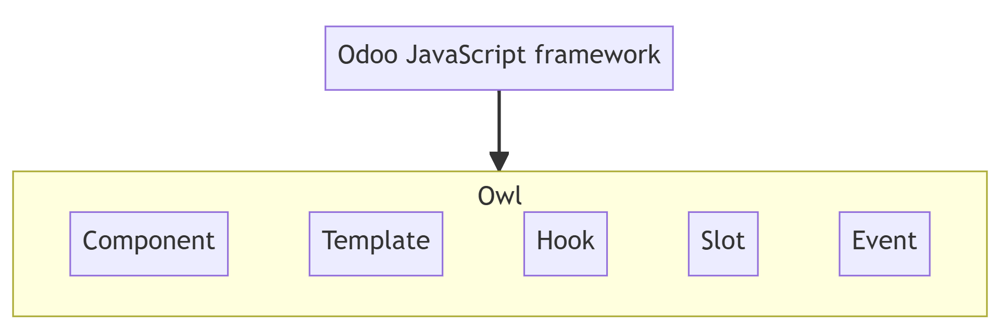

# Chapter 2: Build a dashboard

https://www.odoo.com/documentation/17.0/developer/tutorials/discover_js_framework/02_build_a_dashboard.html

The first part of this tutorial introduced you to most of Owl ideas. It is now time to learn about the Odoo JavaScript framework in its entirety, as used by the web client



To get started, you need a running Odoo server and a development environment setup. Before getting into the exercises, make sure you have followed all the steps described in this tutorial introduction. For this chapter, we will start from the empty dashboard provided by the `awesome_dashboard` addon. We will progressively add features to it, using the Odoo JavaScript framework.

- **Solutions**
- https://github.com/odoo/tutorials/commits/17.0-discover-js-framework-solutions/awesome_dashboard


## 1. A new Layout

- Most screens in the Odoo web client uses a common layout: a control panel on top, with some buttons, and a main content zone just below. This is done using the **Layout** component, available in `@web/search/layout`

- https://github.com/odoo/odoo/blob/17.0/addons/web/static/src/search/layout.js

---

1. Update the `AwesomeDashboard` component located in `awesome_dashboard/static/src/` to use the **Layout** component. You can use `{controlPanel: {} }` for the `display` props of the **Layout** component.

2. Add a `className` prop to `Layout: className="'o_dashboard h-100'"`

3. Add a `dashboard.scss` file in which you set the background-color of `.o_dashboard` to gray (or your favorite color)

- Open `http://localhost:8069/web`, then open the **Awesome Dashboard** app, and see the result

- You need to activate **awesome_dashboard** module

---

- **tutorials/awesome_dashboard/static/src/dashboard.js**
```
/** @odoo-module **/

import { Component } from "@odoo/owl";
import { registry } from "@web/core/registry";
import { Layout } from "@web/search/layout";

class AwesomeDashboard extends Component {
  static template = "awesome_dashboard.AwesomeDashboard";
  static components = { Layout };

  setup() {
    this.display = {
      controlPanel: {},
    };
  }
}

registry
  .category("actions")
  .add("awesome_dashboard.dashboard", AwesomeDashboard);
```

- **tutorials/awesome_dashboard/static/src/dashboard.xml**
```
<?xml version="1.0" encoding="UTF-8" ?>
<templates xml:space="preserve">

    <t t-name="awesome_dashboard.AwesomeDashboard">
        <Layout display="display" className="'o_dashboard h-100'">
            <t t-set-slot="layout-buttons">
                 Hello dashboard
            </t>
             some content
        </Layout>
    </t>

</templates>
```

- **tutorials/awesome_dashboard/static/src/dashboard.scss**
```
.o_dashboard {
  background-color: lightgrey;
}
```

---

- 📄 **See also**
- Example: use of Layout in client action and template
- https://github.com/odoo/odoo/blob/17.0/addons/web/static/src/webclient/actions/reports/report_action.js
- https://github.com/odoo/odoo/blob/17.0/addons/web/static/src/webclient/actions/reports/report_action.xml
- Example: use of Layout in kanban view
- https://github.com/odoo/odoo/blob/17.0/addons/web/static/src/views/kanban/kanban_controller.xml


## Theory: Services

In practice, every component (except the root component) may be destroyed at any time and replaced (or not) with another component. This means that each component internal state is not persistent. This is fine in many cases, but there certainly are situations where we want to keep some data around. For example, all Discuss messages should not be reloaded every time we display a channel.

Also, it may happen that we need to write some code that is not a component. Maybe something that process all barcodes, or that manages the user configuration (context, etc.).

The Odoo framework defines the idea of a **service**, which is a persistent piece of code that exports state and/or functions. Each service can depend on other services, and components can import a service

- https://www.odoo.com/documentation/17.0/developer/reference/frontend/services.html#frontend-services

The following example registers a simple service that displays a notification every 5 seconds:
```
import { registry } from "@web/core/registry";

const myService = {
    dependencies: ["notification"],
    start(env, { notification }) {
        let counter = 1;
        setInterval(() => {
            notification.add(`Tick Tock ${counter++}`);
        }, 5000);
    },
};

registry.category("services").add("myService", myService);
```

Services can be accessed by any component. Imagine that we have a service to maintain some shared state:
```
import { registry } from "@web/core/registry";

const sharedStateService = {
    start(env) {
        let state = {};
        return {
            getValue(key) {
                return state[key];
            },
            setValue(key, value) {
                state[key] = value;
            },
        };
    },
};

registry.category("services").add("shared_state", sharedStateService);
```

Then, any component can do this:
```
import { useService } from "@web/core/utils/hooks";

setup() {
   this.sharedState = useService("shared_state");
   const value = this.sharedState.getValue("somekey");
   // do something with value
}
```