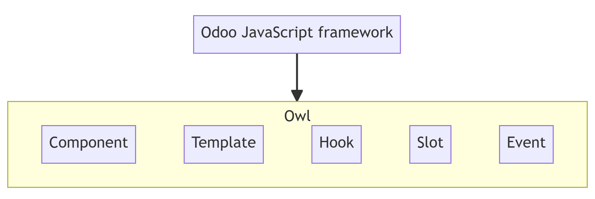

# Chapter 2: Build a dashboard

https://www.odoo.com/documentation/17.0/developer/tutorials/discover_js_framework/02_build_a_dashboard.html

The first part of this tutorial introduced you to most of Owl ideas. It is now time to learn about the Odoo JavaScript framework in its entirety, as used by the web client



To get started, you need a running Odoo server and a development environment setup. Before getting into the exercises, make sure you have followed all the steps described in this tutorial introduction. For this chapter, we will start from the empty dashboard provided by the `awesome_dashboard` addon. We will progressively add features to it, using the Odoo JavaScript framework.

- **Solutions**
- https://github.com/odoo/tutorials/commits/17.0-discover-js-framework-solutions/awesome_dashboard


## 1. A new Layout

- Most screens in the Odoo web client uses a common layout: a control panel on top, with some buttons, and a main content zone just below. This is done using the **Layout** component, available in `@web/search/layout`

- https://github.com/odoo/odoo/blob/17.0/addons/web/static/src/search/layout.js

---

1. Update the `AwesomeDashboard` component located in `awesome_dashboard/static/src/` to use the **Layout** component. You can use `{controlPanel: {} }` for the `display` props of the **Layout** component.

2. Add a `className` prop to `Layout: className="'o_dashboard h-100'"`

3. Add a `dashboard.scss` file in which you set the background-color of `.o_dashboard` to gray (or your favorite color)

- Open `http://localhost:8069/web`, then open the **Awesome Dashboard** app, and see the result

- You need to activate **awesome_dashboard** module

---

- **tutorials/awesome_dashboard/static/src/dashboard.js**
```
/** @odoo-module **/

import { Component } from "@odoo/owl";
import { registry } from "@web/core/registry";
import { Layout } from "@web/search/layout";

class AwesomeDashboard extends Component {
  static template = "awesome_dashboard.AwesomeDashboard";
  static components = { Layout };

  setup() {
    this.display = {
      controlPanel: {},
    };
  }
}

registry
  .category("actions")
  .add("awesome_dashboard.dashboard", AwesomeDashboard);
```

- **tutorials/awesome_dashboard/static/src/dashboard.xml**
```
<?xml version="1.0" encoding="UTF-8" ?>
<templates xml:space="preserve">

    <t t-name="awesome_dashboard.AwesomeDashboard">
        <Layout display="display" className="'o_dashboard h-100'">
            <t t-set-slot="layout-buttons">
                 Hello dashboard
            </t>
             some content
        </Layout>
    </t>

</templates>
```

- **tutorials/awesome_dashboard/static/src/dashboard.scss**
```
.o_dashboard {
  background-color: lightgrey;
}
```

---

- 📄 **See also**
- Example: use of Layout in client action and template
- https://github.com/odoo/odoo/blob/17.0/addons/web/static/src/webclient/actions/reports/report_action.js
- https://github.com/odoo/odoo/blob/17.0/addons/web/static/src/webclient/actions/reports/report_action.xml
- Example: use of Layout in kanban view
- https://github.com/odoo/odoo/blob/17.0/addons/web/static/src/views/kanban/kanban_controller.xml


## Theory: Services

In practice, every component (except the root component) may be destroyed at any time and replaced (or not) with another component. This means that each component internal state is not persistent. This is fine in many cases, but there certainly are situations where we want to keep some data around. For example, all Discuss messages should not be reloaded every time we display a channel.

Also, it may happen that we need to write some code that is not a component. Maybe something that process all barcodes, or that manages the user configuration (context, etc.).

The Odoo framework defines the idea of a **service**, which is a persistent piece of code that exports state and/or functions. Each service can depend on other services, and components can import a service

- https://www.odoo.com/documentation/17.0/developer/reference/frontend/services.html#frontend-services

The following example registers a simple service that displays a notification every 5 seconds:
```
import { registry } from "@web/core/registry";

const myService = {
    dependencies: ["notification"],
    start(env, { notification }) {
        let counter = 1;
        setInterval(() => {
            notification.add(`Tick Tock ${counter++}`);
        }, 5000);
    },
};

registry.category("services").add("myService", myService);
```

Services can be accessed by any component. Imagine that we have a service to maintain some shared state:
```
import { registry } from "@web/core/registry";

const sharedStateService = {
    start(env) {
        let state = {};
        return {
            getValue(key) {
                return state[key];
            },
            setValue(key, value) {
                state[key] = value;
            },
        };
    },
};

registry.category("services").add("shared_state", sharedStateService);
```

Then, any component can do this:
```
import { useService } from "@web/core/utils/hooks";

setup() {
   this.sharedState = useService("shared_state");
   const value = this.sharedState.getValue("somekey");
   // do something with value
}
```

## 2. Add some buttons for quick navigation

One important service provided by Odoo is the `action` service: it can execute all kind of standard actions defined by Odoo. For example, here is how one component could execute an *action* by its *xml* id:
```
import { useService } from "@web/core/utils/hooks";
...
setup() {
      this.action = useService("action");
}
openSettings() {
      this.action.doAction("base_setup.action_general_configuration");
}
...
```

Let us now add two buttons to our control panel:

1. A button `Customers`, which opens a kanban view with all customers (this action already exists, so you should use its xml id).
- https://github.com/odoo/odoo/blob/1f4e583ba20a01f4c44b0a4ada42c4d3bb074273/odoo/addons/base/views/res_partner_views.xml#L510

2. A button `Leads`, which opens a dynamic action on the `crm.lead` model with a list and a form view. Follow the example of this use of the action service.
- https://github.com/odoo/odoo/blob/ef424a9dc22a5abbe7b0a6eff61cf113826f04c0/addons/account/static/src/components/journal_dashboard_activity/journal_dashboard_activity.js#L28-L35

---

- **tutorials/awesome_dashboard/static/src/dashboard.js**
```
/** @odoo-module **/
...
import { useService } from "@web/core/utils/hooks";

class AwesomeDashboard extends Component {
...

  setup() {
    this.action = useService("action");
    this.display = {
      controlPanel: {},
    };
  }

  openCustomerView() {
    this.action.doAction("base.action_partner_form");
  }

  openLeads() {
    this.action.doAction({
      type: "ir.actions.act_window",
      name: "All leads",
      res_model: "crm.lead",
      views: [
        [false, "list"],
        [false, "form"],
      ],
    });
  }
}
...
```

- **tutorials/awesome_dashboard/static/src/dashboard.xml**
```
<?xml version="1.0" encoding="UTF-8" ?>
<templates xml:space="preserve">

    <t t-name="awesome_dashboard.AwesomeDashboard">
        <Layout display="display" className="'o_dashboard h-100'">
            <t t-set-slot="layout-buttons">
                <button class="btn btn-primary" 
                    t-on-click="openCustomerView">Customers</button>
                <button class="btn btn-primary" 
                    t-on-click="openLeads">Leads</button>
            </t>
             some content
        </Layout>
    </t>

</templates>
```

- 📄 **See also**
- Code: action service
- https://github.com/odoo/odoo/blob/17.0/addons/web/static/src/webclient/actions/action_service.js


## 3. Add a dashboard item

Let us now improve our content.

1. Create a generic `DashboardItem` component that display its default slot in a nice card layout. It should take an optional `size` number props, that default to `1`. The width should be hardcoded to`(18*size)rem`

2. Add two cards to the dashboard. One with no size, and the other with a size of 2.

- **tutorials/awesome_dashboard/static/src/dashboard_item/dashboard_item.js**
```
/** @odoo-module */
import { Component } from "@odoo/owl";

export class DashboardItem extends Component {
  static template = "awesome_dashboard.DashboardItem";
  static props = {
    slots: {
      type: Object,
      shape: {
        default: Object,
      },
    },
    size: {
      type: Number,
      default: 1,
      optional: true,
    },
  };
}
```

- **tutorials/awesome_dashboard/static/src/dashboard_item/dashboard_item.xml**
```
<?xml version="1.0" encoding="UTF-8" ?>
<templates xml:space="preserve">
    <t t-name="awesome_dashboard.DashboardItem">
        <div class="card m-2 border-dark" t-attf-style="width: {{18*props.size}}rem;">
            <div class="card-body">
                <t t-slot="default"/>
            </div>
        </div>
    </t>
</templates>
```

- **tutorials/awesome_dashboard/static/src/dashboard.js**
```
import { DashboardItem } from "./dashboard_item/dashboard_item";
...

class AwesomeDashboard extends Component {
  static components = { Layout, DashboardItem };
...
}

```

- **tutorials/awesome_dashboard/static/src/dashboard.xml**
```
<?xml version="1.0" encoding="UTF-8" ?>
<templates xml:space="preserve">
    <t t-name="awesome_dashboard.AwesomeDashboard">
        <Layout display="display" className="'o_dashboard h-100'">
            <t t-set-slot="layout-buttons">
                <button class="btn btn-primary" t-on-click="openCustomerView">Customers</button>
                <button class="btn btn-primary" t-on-click="openLeads">Leads</button>
            </t>
            <div class="d-flex flex-wrap">
                <DashboardItem>
                    some content
                </DashboardItem>
                <DashboardItem size="2">
                    I love milk
                </DashboardItem>
                <DashboardItem>
                    some content
                </DashboardItem>
            </div>
        </Layout>
    </t>
</templates>
```

## 4. Call the server, add some statistics

Let’s improve the dashboard by adding a few dashboard items to display real business data. The `awesome_dashboard` addon provides a `/awesome_dashboard/statistics` route that is meant to return some interesting information.

To call a specific controller, we need to use the **rpc service**. It only exports a single function that perform the request: `rpc(route, params, settings`)`. A basic request could look like this:

- https://www.odoo.com/documentation/17.0/developer/reference/frontend/services.html#frontend-services-rpc

```
setup() {
      this.rpc = useService("rpc");
      onWillStart(async () => {
         const result = await this.rpc("/my/controller", {a: 1, b: 2});
         // ...
      });
}
```

1. Update `Dashboard` so that it uses the `rpc` service
2. Call the statistics route `/awesome_dashboard/statistics` in the `onWillStart` hook.
3. Display a few cards in the dashboard containing:
- Number of new orders this month
- Total amount of new orders this month
- Average amount of t-shirt by order this month
- Number of cancelled orders this month
- Average time for an order to go from ‘new’ to ‘sent’ or ‘cancelled’


- **tutorials/awesome_dashboard/static/src/dashboard.js**
```
import { Component, onWillStart  } from "@odoo/owl";
...

  setup() {
    this.action = useService("action");
    this.rpc = useService("rpc");
    this.display = {
      controlPanel: {},
    };
    
    onWillStart(async () => {
            this.statistics = await this.rpc("/awesome_dashboard/statistics");
        });
  }
...

```

- **tutorials/awesome_dashboard/static/src/dashboard.xml**
```
<?xml version="1.0" encoding="UTF-8" ?>
<templates xml:space="preserve">
    <t t-name="awesome_dashboard.AwesomeDashboard">
        <Layout display="display" className="'o_dashboard h-100'">
            <t t-set-slot="layout-buttons">
                <button class="btn btn-primary" t-on-click="openCustomerView">Customers</button>
                <button class="btn btn-primary" t-on-click="openLeads">Leads</button>
            </t>
            <div class="d-flex flex-wrap">
                <DashboardItem>
                    some content
                </DashboardItem>
                <DashboardItem size="2">
                    I love milk
                </DashboardItem>
                <DashboardItem>
                    some content
                </DashboardItem>
                <DashboardItem>
                    Average amount of t-shirt by order this month
                    <div class="fs-1 fw-bold text-success text-center">
                        <t t-esc="statistics.average_quantity"/>
                    </div>
                </DashboardItem>
                <DashboardItem>
                    Average time for an order to go from 'new' to 'sent' or 'cancelled'
                    <div class="fs-1 fw-bold text-success text-center">
                        <t t-esc="statistics.average_time"/>
                    </div>
                </DashboardItem>
                <DashboardItem>
                    Number of new orders this month
                    <div class="fs-1 fw-bold text-success text-center">
                        <t t-esc="statistics.nb_new_orders"/>
                    </div>
                </DashboardItem>
                <DashboardItem>
                    Number of cancelled orders this month
                    <div class="fs-1 fw-bold text-success text-center">
                        <t t-esc="statistics.nb_cancelled_orders"/>
                    </div>
                </DashboardItem>
                <DashboardItem>
                    Total amount of new orders this month
                    <div class="fs-1 fw-bold text-success text-center">
                        <t t-esc="statistics.total_amount"/>
                    </div>
                </DashboardItem>
            </div>
        </Layout>
    </t>
</templates>
```


## 5. Cache network calls, create a service

If you open the **Network** tab of your browser’s dev tools, you will see that the call to `/awesome_dashboard/statistics` is done every time the client action is displayed. This is because the `onWillStart` hook is called each time the `Dashboard` component is mounted. But in this case, we would prefer to do it only the first time, so we actually need to maintain some state outside of the `Dashboard` component. This is a nice use case for a service!

1. Register and import a new `awesome_dashboard.statistics` service.
2. It should provide a function `loadStatistics` that, once called, performs the actual rpc, and always return the same information.
3. Use the *memoize* utility function from `@web/core/utils/functions` that allows caching the statistics.
4. Use this service in the `Dashboard` component.
5. Check that it works as expected.

- https://github.com/odoo/odoo/blob/17.0/addons/web/static/src/core/network/http_service.js
- https://github.com/odoo/odoo/blob/17.0/addons/web/static/src/core/user_service.js


- **tutorials/awesome_dashboard/static/src/statistics_service.js**
```
/** @odoo-module */

import { registry } from "@web/core/registry";
import { memoize } from "@web/core/utils/functions";

const statisticsService = {
  dependencies: ["rpc"],
  async: ["loadStatistics"],
  start(env, { rpc }) {
    return {
      loadStatistics: memoize(() => rpc("/awesome_dashboard/statistics")),
    };
  },
};

registry
  .category("services")
  .add("awesome_dashboard.statistics", statisticsService);
```

- **tutorials/awesome_dashboard/static/src/dashboard.js**
```
  setup() {
    this.action = useService("action");
    // this.rpc = useService("rpc");
    this.statistics = useService("awesome_dashboard.statistics");
    this.display = {
      controlPanel: {},
    };

    onWillStart(async () => {
      // this.statistics = await this.rpc("/awesome_dashboard/statistics");
      this.statistics = await this.statistics.loadStatistics();
    });
  }
```


## 6. Display a pie chart

Everyone likes charts (!), so let us add a pie chart in our dashboard. It will display the proportions of t-shirts sold for each size: S/M/L/XL/XXL.

For this exercise, we will use **Chart.js**. It is the chart library used by the graph view. However, it is not loaded by default, so we will need to either add it to our assets bundle, or lazy load it. Lazy loading is usually better since our users will not have to load the chartjs code every time if they don’t need it.

1. Create a `PieChart` component.
2. In its `onWillStart` method, load chartjs, you can use the `loadJs` function to load `/web/static/lib/Chart/Chart.js`.
3. Use the `PieChart` component in a `DashboardItem` to display a pie chart that shows the quantity for each sold t-shirts in each size (that information is available in the `/statistics` route). Note that you can use the `size` property to make it look larger.
4. The `PieChart` component will need to render a canvas, and draw on it using `chart.js`.
5. Make it work!

- **tutorials/awesome_dashboard/static/src/pie_chart/pie_chart.js**
```
/** @odoo-module */

import { loadJS } from "@web/core/assets";
import { getColor } from "@web/core/colors/colors";
import {
  Component,
  onWillStart,
  useRef,
  onMounted,
  onWillUnmount,
} from "@odoo/owl";

export class PieChart extends Component {
  static template = "awesome_dashboard.PieChart";
  static props = {
    label: String,
    data: Object,
  };

  setup() {
    this.canvasRef = useRef("canvas");
    onWillStart(() => loadJS(["/web/static/lib/Chart/Chart.js"]));
    onMounted(() => {
      this.renderChart();
    });
    onWillUnmount(() => {
      this.chart.destroy();
    });
  }

  renderChart() {
    const labels = Object.keys(this.props.data);
    const data = Object.values(this.props.data);
    const color = labels.map((_, index) => getColor(index));
    this.chart = new Chart(this.canvasRef.el, {
      type: "pie",
      data: {
        labels: labels,
        datasets: [
          {
            label: this.props.label,
            data: data,
            backgroundColor: color,
          },
        ],
      },
    });
  }
}
```

- **tutorials/awesome_dashboard/static/src/pie_chart/pie_chart.xml**
```
<?xml version="1.0" encoding="UTF-8" ?>
<templates xml:space="preserve">
    <t t-name="awesome_dashboard.PieChart">
        <div t-att-class="'h-100 ' + props.class" t-ref="root">
            <div class="h-100 position-relative" t-ref="container">
                <canvas t-ref="canvas" />
            </div>
        </div>
    </t>
</templates>
```

- **tutorials/awesome_dashboard/static/src/dashboard.js**
```
...
import { PieChart } from "./pie_chart/pie_chart";
...
class AwesomeDashboard extends Component {
  static template = "awesome_dashboard.AwesomeDashboard";
  static components = { Layout, DashboardItem, PieChart };
...
```

- **tutorials/awesome_dashboard/static/src/dashboard.xml**
```
...
<DashboardItem size="2">
    Shirt orders by size
    <PieChart data="statistics['orders_by_size']" label="'Shirt orders by size'"/>
</DashboardItem>
...
```
